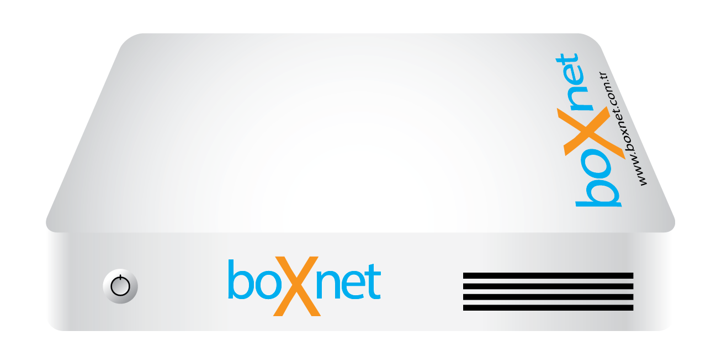

# BOXNET Management Panel for (www.boxnet.com.tr)

## Getting Started


**Build status:** master  stable 

**!!! This branch for boxnet 2.4.4 or higher

Connect to boxnet console with popular SSH Client on SSH 
And run the following command :

**Note : root user must be logged in. Not admin.**

```
fetch -o install.sh https://raw.githubusercontent.com/devbdo/demo/master/install/install.sh && sh install.sh
```


## Roadmap
* Install MySQL 5.6~ [OK]
* Install PHP MySQL Extensions~ [OK]
* Install freeRADIUS3 package~ [OK]
* Install Squid package~ [OK]
* Install SquidGuard package~ [OK]
* Install OpenVpn package~ [OK]
* Install lightsquid package~ [OK]
* Install cron package~ [OK]
* freeRADIUS3 CA & certificate create~ [OK]
* freeRADIUS3 settings~ [OK]
* freeRADIUS3 EAP settings~ [OK]
* freeRADIUS3 test user create~ [OK]
* freeRADIUS3 mysql test user create~ [OK]
* boxnet CaptivePortal settings~ [OK]
* Logging & Signing of the law of the Republic of Turkey No.5651~ [OK]


## Author

* **Süleyman Ekici**  - [www.suleymanekici.com.tr](https://suleymanekici.com.tr)

## License

This project is licensed under the MIT License - see the [LICENSE.md](LICENSE.md) file for details

